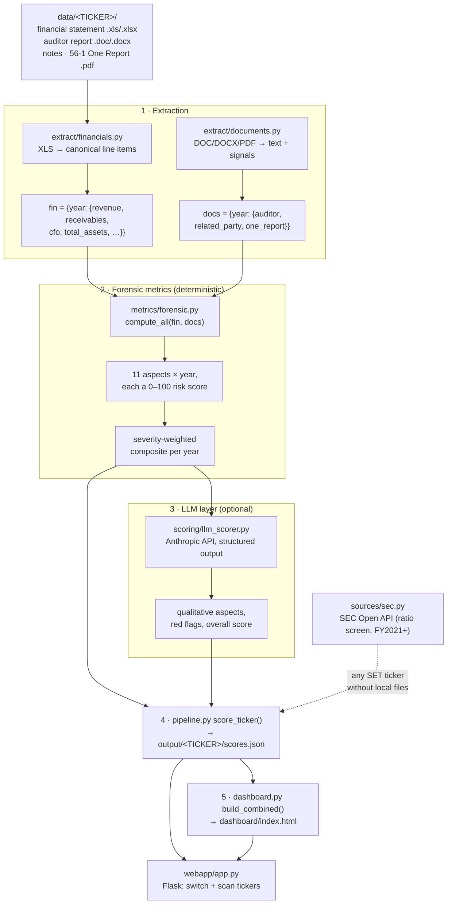

# Pipeline — how a filing becomes a risk score

End-to-end flow from raw Thai annual filings to the switchable dashboard. Every
stage is a real module under `src/`; this document maps the data as it moves
through them.



---

## 0 · Input — `data/<TICKER>/`

Generalizable folder layout (JKN, DELTA, STARK bundled):

```
data/<TICKER>/financial statement|report/<TICKER> <BE_YEAR>/
    FINANCIAL_STATEMENTS.xls|xlsx     ← the numbers
    AUDITOR_REPORT.doc|docx           ← opinion, emphasis-of-matter, auditor identity
    NOTES.doc|docx                    ← related-party disclosures
data/<TICKER>/one report/56-1 <TICKER> <BE_YEAR>/…pdf   ← governance, MD&A, board
```

`BE_YEAR` is the Buddhist-era year (CE + 543). Two entry points drive everything:

```bash
python src/pipeline.py [TICKER…]     # extract + score  → output/<TICKER>/scores.json
python src/dashboard.py              # render all scored → dashboard/index.html
# flags:  SKIP_LLM=1   SKIP_ONE_REPORT=1   ANTHROPIC_API_KEY=…   SEC_API_KEY=…
```

---

## 1 · Extraction

### 1a. Financials — `extract/financials.py`

Turns a Thai `.xls`/`.xlsx` into `{year: {canonical_field: value}}`. The hard parts,
all solved here:

- **Encoding** — labels are TIS-620; recovered with `raw.encode('latin1').decode('tis-620')`.
- **Section detection** — statement titles inside cells switch the active section
  (balance / income / cashflow), so identical Thai labels in different statements
  never collide. Handles both one-sheet-per-statement and combined-sheet layouts.
- **Dynamic value columns** — the leftmost pair of numeric columns = the
  *consolidated* current/prior year; note-reference and separate-entity columns
  are excluded automatically.
- **Label matching** — a lexicon (`thai_lexicon.py`) maps Thai line items to
  canonical fields via `eq` / `in` / `startswith` / **`re` (regex)** rules. Regex
  tolerates parenthetical inserts like `เงินสดสุทธิได้มาจาก (ใช้ไปใน) กิจกรรมดำเนินงาน`.

Output fields: `revenue, cogs, net_income, receivables, inventory, current_assets,
total_assets, ppe, intangibles_rights, current_liabilities, total_liabilities,
total_equity, retained_earnings, operating_income, finance_cost, pretax_income,
cfo, amortization, depreciation`.

### 1b. Documents — `extract/documents.py`

`get_text()` reads `.docx` (python-docx), legacy `.doc` (Word COM), and `.pdf`
(pdfplumber). From that text it derives:

- **Auditor** (`analyze_auditor`) — opinion type (unqualified/qualified/adverse/
  disclaimer), going-concern, emphasis-of-matter (with cited text), **audit firm +
  Big-4 flag + CPA licence number** (for rotation detection).
- **Related party** (`analyze_related_party`) — mention density in the notes.
- **One Report** (`extract_one_report`) — governance/MD&A text + related-party
  density from the 56-1 filing.

---

## 2 · Forensic metrics — `metrics/forensic.py`

`compute_all(fin, docs)` produces, per year, **11 aspects**, each a transparent
0–100 risk sub-score (higher = riskier) from published thresholds:

| Aspect | Signal | Needs |
|---|---|---|
| `beneish` | Beneish M-Score (8 vars) — earnings manipulation | line items + CFO |
| `altman` | Altman Z''-Score — financial distress | balance sheet + EBIT |
| `accruals` | Sloan accruals, CFO vs net income | CFO, net income |
| `receivables` | DSO level + receivable-vs-revenue divergence | receivables, revenue |
| `leverage` | D/E, current ratio, interest coverage | balance sheet |
| `piotroski` | Piotroski F (8 checks), inverted | multi-year |
| `oneoff` | non-recurring / non-cash gains ÷ pre-tax | income statement |
| `intangible` | intangibles ÷ assets, amortisation ÷ revenue | content-model filers |
| `cash_conversion` | free cash flow = CFO − content reinvestment | CFO + intangibles |
| `governance` | auditor rotation / **Big-4 downgrade**, opinion, RPT growth | documents |
| `profitability` | margin level + trend | income statement |

Aspects self-disable (`available: False`) when their inputs are missing, so a
manufacturer with no content library simply shows `cash_conversion: n/a`.

**Composite** (severity-weighted, so a few screaming flags dominate — the right
behaviour for fraud):

```
composite = 0.45 · weighted_mean(available aspects)
          + 0.55 · mean(top-3 aspect scores)
```

---

## 3 · LLM layer (optional) — `scoring/llm_scorer.py`

If `ANTHROPIC_API_KEY` is set, each year's **evidence package** (financials +
deterministic metrics + auditor/One-Report text) is sent to Claude
(`claude-opus-4-8`, adaptive thinking, structured JSON output). It scores *on top
of* the numbers and returns qualitative aspects (auditor, related-party, revenue
recognition, governance), cited red flags, and a synthesised overall score. Absent
a key, the pipeline degrades cleanly to the deterministic composite.

---

## 4 · Assembly — `pipeline.py`

`score_ticker(ticker, fin, docs)` is the source-agnostic core: it runs the metrics,
attaches documents + LLM output, sets `overall_score` (LLM score if available, else
the quant composite), and writes **`output/<TICKER>/scores.json`**. `run_ticker()`
is the local-file adapter (extract → score).

---

## 5 · Presentation

- **`dashboard.py build_combined()`** — embeds every `scores.json` into one
  self-contained **`dashboard/index.html`**: a "Compare tickers" switcher, per-year
  aspect meters, multi-year trend, aspect×year heatmap, cash-conversion panel,
  governance/auditor table, and financials. No server, no external requests.
- **`webapp/app.py`** — Flask app serving that page at `/` with a "scan another
  ticker" box; scores on demand from local files or the SEC API.

---

## Alternate source — `sources/sec.py` (SEC Open API)

For any SET ticker without local files (when `SEC_API_KEY` is set). Resolves
ticker → `unique_id`, pulls the Form 56-1 One Report `fs` endpoint, and maps
SET's standardized account/ratio codes (e.g. `760427` = D/E, `760112` = current
ratio, `519999` = operating cash flow).

> **Constraint:** the One Report `fs` endpoint returns **financial highlights +
> pre-computed ratios, not full line items** (its balance sheet is equity-only),
> and covers **FY2021 onward only**. So the SEC path is a lighter **ratio-based
> screen** (leverage, liquidity, collection days, margins, free cash flow,
> governance) — not the full Beneish/Altman analysis, which needs the filed
> statements in `data/<TICKER>/`.

---

## Extending

- **New ticker, full depth:** drop its filings into `data/<TICKER>/` → `python src/pipeline.py <TICKER>`.
- **New line item / label variant:** add a rule to `FIELD_RULES` in `thai_lexicon.py`.
- **New risk aspect:** add a function in `forensic.py`, register it in `compute_year`,
  `ASPECT_LABELS`, `ASPECT_WEIGHTS`, and the dashboard's `ASPECT_ORDER`.
